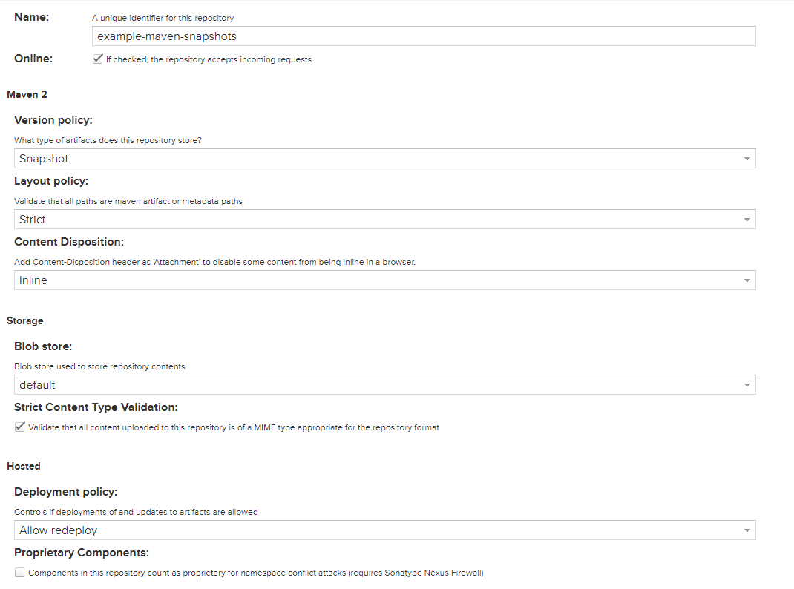

# Nexus with Maven

1. Nội dung
    1. Tạo `snapshots` repository
        
        
        
        - Được sử dụng để chứa các artifacts được deploy với version tag `-SNAPSHOT` trong file `pom.xml`
    2. Tạo `releases` repository
        
        
        
        - Được sử dụng để chứa các artifacts được deploy khi không có version tag `-SNAPSHOT` thường được thêm version tag `-RELEASE` trong file `pom.xml`
        - `deployment policy: disable redeploy`: Để ngăn chặn việc deploy lại 1 artifact.
    3. Tạo `maven central` repository
        
        
        
        
        
        - Được sử dụng để proxy các artifact được download từ Maven Central. Lần tải tiếp theo với cùng một dependency, nó sẽ được sử dụng bản cached trong Nexus.
        - `remote storage`: `https://repo1.maven.org/maven2/`
    4. Tạo `group` repository
        
        
        
        - Dùng để nhóm các repository ở trên vào một URL duy nhất để người dùng download hoặc deploy.
    5. Tạo `example-dev` role
        
        
        
    6. Tạo `example-dev` user
        
        
        
    7. Tạo file `~/.m2/settings.xml`
        
        ```xml
        <?xml version="1.0" encoding="UTF-8"?>
        <settings xmlns="http://maven.apache.org/SETTINGS/1.1.0"
          xmlns:xsi="http://www.w3.org/2001/XMLSchema-instance"
          xsi:schemaLocation="http://maven.apache.org/SETTINGS/1.1.0 http://maven.apache.org/xsd/settings-1.1.0.xsd">
        
          <servers>
            <server>
              <id>nexus</id> # same with id repository in pom.xml
              <username>example-dev</username> # username account nexus
              <password>password</password> # password account nexus
            </server>
          </servers>
        
          <mirrors>
            <mirror>
              <id>nexus</id> # same with id repository in pom.xml
              <name>nexus</name>
              <url>https://nexus.tranvannhan1911.tk/repository/example-maven-public/</url>
              <mirrorOf>*</mirrorOf>
            </mirror>
          </mirrors>
        </settings>
        ```
        
    8. Sửa repository trong pom.xml
        
        ```xml
        <project>
        	...
        	<distributionManagement>
        		<repository>
        			<id>nexus</id> # same with id server in settings.xml
        			<name>maven-releases</name>
        			<url>https://nexus.tranvannhan1911.tk/repository/example-maven-releases/</url>
        		</repository>
        		<snapshotRepository>
        			<id>nexus</id> # same with id server in settings.xml
        			<name>maven-snapshots</name>
        			<url>https://nexus.tranvannhan1911.tk/repository/example-maven-snapshots/</url>
        		</snapshotRepository>
        	</distributionManagement>
        	...
        </project>
        ```
        
    9. install
        
        ```bash
        $ mvn install
        ```
        
        - Lúc này maven sẽ install các dependencies từ Nexus repository.
        - Các package sẽ được hiển thị trong `example-maven-public` repository (reposirory được khai báo trong file settings.xml).
    10. deploy
        
        ```bash
        $ mvn deploy
        ```
        
        - Maven sẽ build và upload package lên Nexus repository.
        - Tùy vào version trong file pom mà package được upload lên repository tương ứng.
            - Ví dụ: với version `0.0.1-SNAPSHOT` thì package sẽ được upload lên `snapshotRepository` được khai báo trong file pom.xml (ở đây là `maven-snapshots` repository)
            - Với version `0.0.1-RELEASE` thì package sẽ được upload lên `repository` được khai báo trong file pom.xml (ở đây là `maven-releases` repository)
        - Với SNAPSHOT
            - Lúc này nexus sẽ tạo các version dựa vào thời gian deploy và lần deploy package.
                - `<version>-SNAPSHOT/<version>-<date>.<time>-<buildNumber>`
                - Ví dụ: `0.0.1-SNAPSHOT/0.0.1-20220621.152416-1`
                - Lúc này artifact mới được tạo là `0.0.1-20220621.152416-1`
        - Với RELEASE
            - Lúc này chỉ được phép tồn tại 1 version duy nhất trên repository
            - Nếu deploy cùng một version sẽ gặp lỗi
    11. Usage
        
        ```bash
        <dependency>
          <groupId>com.example.nexus_maven_example</groupId>
          <artifactId>nexus_maven_example</artifactId>
          <version>0.0.1-20220621.152416-1</version>
        </dependency>
        ```
        
        - Đi tới repository tương ứng trên nexus repository browser.
        - Bấm vào artifact muốn sử dụng
        - Chọn version, sau đó copy dependency text như trên và dán vào file pom.xml của project cần sử dụng
    12. Kết quả sau khi deploy
        
        
        
        
        
2. Tài liệu tham khảo
    1. [https://blog.sonatype.com/using-nexus-3-as-your-repository-part-1-maven-artifacts](https://blog.sonatype.com/using-nexus-3-as-your-repository-part-1-maven-artifacts)
    2. [https://www.youtube.com/watch?v=yZFvJEygn_g](https://www.youtube.com/watch?v=yZFvJEygn_g)
